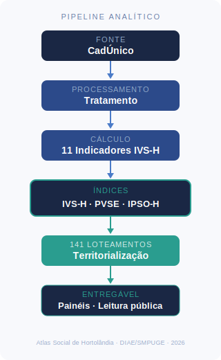

[README (17).md](https://github.com/user-attachments/files/28105485/README.17.md)[Uploading R# Atlas Social de Hortolândia
**Inteligência de Política Pública Socioassistencial**

Repositório oficial do **Atlas Social de Hortolândia** — sistema municipal de inteligência territorial desenvolvido pelo **DIAE / SMPUGE** da Prefeitura de Hortolândia – SP.

O projeto estrutura uma infraestrutura analítica capaz de compreender, territorializar e acompanhar a dinâmica da vulnerabilidade social no município, utilizando exclusivamente dados públicos já existentes e respeitando integralmente a LGPD.

> *"O IVS mostra onde está a vulnerabilidade. O IPST-H mostra onde a vulnerabilidade se transforma em pressão sobre o Estado."*

---

## Contexto

Hortolândia possui aproximadamente **230 mil habitantes** e **72.424 pessoas inscritas no Cadastro Único** (dez/2025) — quase **1 em cada 3 moradores**.

Em maio de 2026, o município alcançou a **30ª posição nacional** no Índice de Progresso Social (IPS Brasil 2026), entre 5.570 municípios avaliados, liderando a Região Metropolitana de Campinas. O resultado valida a trajetória de investimento em políticas públicas — e ao mesmo tempo evidencia o argumento central do Atlas: **índices agregados escondem vulnerabilidades territoriais que só a granularidade de loteamento revela.**

Apesar da escala da política socioassistencial, os dados disponíveis ainda não permitem responder com precisão perguntas fundamentais:

- Quem está sendo atendido — e quem deveria estar e não está?
- Em qual loteamento estão as famílias mais vulneráveis?
- Qual a pressão real sobre cada unidade da rede de serviços?
- As políticas estão de fato mudando a vida das pessoas?

---

## Princípio central

> **A arquitetura de dados deve refletir a política pública — nunca substituí-la.**

A modelagem proposta não altera fluxos institucionais, não cria novos cadastros e não redefine competências administrativas. Ela organiza os **dados já existentes** para permitir leitura estratégica, territorial e longitudinal da política socioassistencial.

---

## Arquitetura dos três instrumentos

O Atlas Social opera com três instrumentos analíticos distintos e complementares:

```
┌──────────────────────────────────────────────────────┐
│  IVS-H                                               │
│  Índice de Vulnerabilidade Social — Hortolândia      │
│  Pergunta: onde está a vulnerabilidade?              │
│  Base: CadÚnico + IBGE · Granularidade: loteamento   │
└──────────────────────────────────────────────────────┘
                    ↕ interface narrativa
┌──────────────────────────────────────────────────────┐
│  IPST-H                                              │
│  Índice de Pressão Social Territorial                │
│  Pergunta: onde a vulnerabilidade pressiona o Estado?│
│  Base: dados administrativos e fluxos operacionais   │
└──────────────────────────────────────────────────────┘
                    ↕ interface narrativa
┌──────────────────────────────────────────────────────┐
│  IPSO-H                                              │
│  Índice de Pressão Social Observada                  │
│  Pergunta: o que está acontecendo agora?             │
│  Base: corpus jornalístico estruturado               │
└──────────────────────────────────────────────────────┘
```

Os três instrumentos **não se substituem e não se mesclam metodologicamente**. Cada um responde a uma pergunta distinta e opera em escala temporal diferente.

---

## Cadeia analítica central

```
Pessoa → Família → Domicílio → Loteamento → Programa Social → Serviço → Resultado
```

Hierarquia territorial:

```
Loteamento (141) → Núcleo (área CRAS/UBS/escola) → Região de Planejamento (6 RPs)
```

---

## Fase 1 MVP — Resultados calculados

Oito indicadores calculados a partir do CadÚnico (dez/2025), metodologia compatível com o IVS/IPEA, rastreabilidade completa.

| Dimensão | Indicador | Resultado | Base |
|---|---|---|---|
| Renda e Trabalho | RT_01 — Renda per capita ≤ ½ SM | **64,7%** · 47.029 pessoas | 72.424 |
| Renda e Trabalho | RT_04 — Idosos em domicílios de baixa renda | **90,1%** · 10.610 idosos | 11.787 |
| Capital Humano | CH_02 — Crianças 0–5 fora da creche | **53,1%** · 3.851 crianças | 7.251 |
| Capital Humano | CH_03 — Crianças 6–14 fora da escola | **0,97%** · 133 crianças | 13.681 |
| Capital Humano | CH_05 — Mães RF sem fundamental (filho <15) | **8,63%** · 2.129 mães | 24.663 |
| Capital Humano | CH_06 — Analfabetismo 15+ | **8,6%** · 4.406 pessoas | 51.492 |
| Capital Humano | CH_07 — Crianças em lares sem adulto escolarizado | **10,86%** · 2.273 crianças | 20.932 |
| Capital Humano | CH_08 — Jovens 15–24 nem-nem | **9,33%** · 995 jovens | 10.667 |

> Todos os indicadores calculados sobre a base CadÚnico dez/2025. O CadÚnico não representa a população total do município (~230 mil habitantes) — representa a população já ao alcance da política pública municipal.

**Referência histórica:** IVS IPEA 2010 = 0,324 (▼ -0,116 desde 2000). IVCAD municipal (MDS, abr/2026) = 0,262.

---

## O poder da granularidade — Jardim Amanda

Ao territorializar os indicadores por loteamento, o Atlas revela o que nenhum índice nacional consegue mostrar. O Jardim Amanda aparece em **1º lugar em todos os indicadores calculados**.

| Indicador | Jardim Amanda | Municipal | Rank |
|---|---|---|---|
| CH_06 — Analfabetismo | 10,30% | 8,6% | 1º |
| CH_07 — Sem fundamental | 11,12% | 10,86% | 1º |
| CH_08 — Nem-nem | 7,77% | 9,33% | 1º |
| RT_04 — Idosos s/ proteção | 89,03% | 90,1% | 1º |

> O IVCAD registra Hortolândia com índice 0,262 — vulnerabilidade moderada. O Atlas mostra que o Jardim Amanda opera em patamar estruturalmente diferente. **Médias municipais escondem vulnerabilidades.**

---

## Corpus jornalístico — IPSO-H

O Atlas mantém uma série histórica estruturada da **Tribuna Liberal**, classificada em schema padronizado (v10.4), com 20 campos por registro.

O corpus funciona como **sensor de pressão social em tempo real**, inaugurando ciclos de pressão que os índices estruturais não capturam. Cada edição é processada individualmente, com controle de versão e rastreabilidade completa.

**Ciclos ativos monitorados (mai/2026):**

| Ciclo | Status |
|---|---|
| CH_VIOLENCIA_GENERO_2025 | agravamento |
| CH_CRIMINALIDADE_2025 | ativo |
| CH_VIOLENCIA_CRIANCA_2026 | ativo |
| IU_ALAGAMENTO_2026 | monitoramento |

> Documentação do schema: `00_governanca/corpus_jornalistico/regras_de_classificacao_v10_4.md`
> Série histórica: `00_governanca/series_jornalisticas/`

---

## IVS-H — Metodologia

O projeto adota o **IVS/IPEA** como referência metodológica nacional e implementa o **IVS-H** — versão local calculada com dados do CadÚnico na granularidade de loteamento.

**Fase 1 (atual):** ponderação IPEA original (`metodo_ponderacao = 'IPEA_ORIGINAL'`) — 5 variáveis disponíveis imediatamente do CadÚnico.

**Fase 2 (planejada):** expansão à medida que fontes adicionais forem disponibilizadas, preservando a estrutura original do índice.

> *"O modelo converge para a incorporação das 16 variáveis do IVS/IPEA à medida que as fontes forem disponibilizadas, preservando a estrutura original do índice."*

---

## O que este repositório não contém

Por razões legais e éticas (LGPD), este repositório **não inclui**:

- dados pessoais ou identificáveis
- microdados do CadÚnico
- informações operacionais de sistemas municipais

O conteúdo disponibilizado inclui apenas estruturas de dados, dicionários, esquemas analíticos, documentação metodológica, scripts SQL/Python e resultados agregados auditáveis.

---

## Estrutura do repositório

| Diretório | Conteúdo |
|---|---|
| `00_governanca` | Regras de classificação, dicionários, README do corpus, fechamentos diários |
| `00_governanca/series_jornalisticas` | CSVs diários do corpus Tribuna Liberal (schema v10.4) |
| `00_governanca/corpus_jornalistico` | Governança metodológica do IPSO-H |
| `01_modelagem_conceitual` | Definição das entidades centrais |
| `02_modelagem_logica` | DDL SQLite, dicionários de dados |
| `03_indicadores_mvp` | Definição e cálculo dos indicadores Fase 1 |
| `04_documento_tecnico` | Documentação formal da arquitetura |
| `05_plano_evolutivo` | Roteiro de evolução e pendências |

---

## Tecnologia

| Camada | Tecnologia |
|---|---|
| Banco de dados | SQLite (Fase 1 — prototipagem) |
| Processamento | Python + Pandas (Jupyter Notebook) |
| Ambiente | Debian 12 (dados) · Windows (documentação) |
| Versionamento | GitHub |
| Próxima etapa | PostgreSQL + pipeline ELT |

---

## Contexto institucional

| | |
|---|---|
| Município | Hortolândia – SP (código IBGE: 3519071) |
| Unidade responsável | DIAE — Departamento de Informação e Análise Estatística |
| Secretaria | SMPUGE — Secretaria Municipal de Planejamento Urbano, Gestão Estratégica e Empreendedorismo |
| Responsável técnico | Ailton Vendramini |
| Ano de início | 2026 |
| Fase atual | Fase 1 MVP — 8 indicadores calculados · corpus jornalístico ativo |

---

## Objetivo de longo prazo

Construir uma **arquitetura de dados sociais replicável para municípios brasileiros**, integrando:

- Cadastro Único
- rede socioassistencial municipal
- equipamentos públicos e unidades de saúde
- bases externas (CAGED, CNIS, SSP-SP, Educação)
- análise territorial contínua da vulnerabilidade social

A escalabilidade será consequência da maturidade institucional — não da ansiedade tecnológica.

---

## Licença

Projeto institucional público. Não contém dados pessoais. Segue os princípios da **Lei Geral de Proteção de Dados (LGPD)** e boas práticas de governança de dados no setor público.
EADME (17).md…]()


XXXXXXXXXXXXXXXXXXXXXXXXXXXXXXXXXXXXXXXXXXXXXXXXXXXXXXXXXXXXXXXXXXXXXXXXXXXXXXXXXXXXXXXXXXXXXXXXXXXX

---

## Como funciona

```
CadÚnico → Tratamento e padronização
         → Indicadores por variável
         → Índices por loteamento
         → Leitura territorial integrada + corpus jornalístico
         → Painéis de apoio à decisão
```



---

## Os cinco instrumentos analíticos


Cada instrumento responde a uma pergunta diferente. Nenhum substitui o outro.

| Instrumento | Pergunta central | Fonte | Escala |
|---|---|---|---|
| **IVS** (IPEA/Censo) | Onde no Brasil? | IBGE Censo | Nacional |
| **IVCAD** (MDS) | Qual o perfil familiar cadastral? | CadÚnico federal | Municipal |
| **IVS-H** ★ | Onde no município? | CadÚnico local | **Loteamento** |
| **IPST-H** | Onde a vulnerabilidade pressiona o Estado? | Dados administrativos | Loteamento |
| **IPSO-H** | O que está acontecendo agora? | Corpus jornalístico | Territorial |

**PVSE** — Perfis de Vulnerabilidade Severa: camada complementar que identifica grupos críticos para intervenção direta.

**Sobre o IVCAD:** o Índice de Vulnerabilidade das Famílias do CadÚnico (MDS) é uma camada complementar de leitura cadastral federal que apoia a compreensão de perfis de vulnerabilidade familiar. O Atlas incorpora o IVCAD como referência — e o desagrega territorialmente até o loteamento, o que nenhum instrumento federal realiza.

> O governo federal enxerga o cadastro. O Atlas Social enxerga a trajetória no loteamento.

---

| 0,440 | 0,324 | ▼ −0,116 |
| Infraestrutura Urbana | 0,405 | 0,411 | ≈ estável |
| Capital Humano | 0,488 | 0,262 | ▼ −0,226 |
| Renda e Trabalho | 0,424 | 0,270 | ▼ −0,154 |

---

## Por que não depender apenas de instrumentos federais

**1. Defasagem temporal**

O IVCAD foi calculado com dados de **2022**. Os indicadores do IVS-H foram calculados com dados de **dezembro/2025** — três anos mais recentes. Nenhum instrumento federal garante atualização no ritmo que a gestão municipal exige.

**2. Soberania municipal**

O Observatório do CadÚnico depende de decisão política e orçamento federal. O Atlas Social não depende de convênio, verba federal nem continuidade política externa. O município controla seus próprios dados e seu próprio ritmo de atualização.

**3. O SIGAS — o ciclo completo**

```
Quem é vulnerável     →  CadÚnico
Quem foi atendido     →  SIGAS
Quem melhorou / permanece / retornou  →  Atlas Social
```

Nenhum instrumento federal fecha esse ciclo. É inteligência longitudinal que só o município pode construir.

---

## Corpus Jornalístico — sensor do IPSO-H

O Atlas mantém um corpus de classificação de notícias do jornal **Tribuna Liberal**, sensor de pressão social territorial. Ciclos ativos:

- `IU_ALAGAMENTO_2026` — alagamentos urbanos recorrentes
- `CH_CRIMINALIDADE_2025` — violência urbana territorial
- `CH_VIOLENCIA_CRIANCA_2026` — violência contra crianças
- `CH_EXCLUSAO_DIGITAL_2026` — fricção entre digitalização estatal e populações vulneráveis
- `RT_DATACENTERS_REGIONAL_2026` — transformação econômica territorial

---

## Estrutura do repositório


| Diretório | Conteúdo |
|---|---|
| `00_governanca` | Regras de classificação, dicionários, READMEs do corpus |
| `00_governanca/series_jornalisticas` | CSVs diários do corpus Tribuna Liberal |
| `01_modelagem_conceitual` | Definição das entidades centrais |
| `02_modelagem_logica` | Esquemas, dicionários e DDLs |
| `dados/cadunico` | Scripts e outputs agregados (sem dados pessoais) |
| `dados/bd_externos` | Dados públicos: IPEA, IBGE, corpus jornalístico |
| `notebooks` | Pipeline IVS-H em Jupyter |
| `outputs` | Resultados agregados e painéis |
| `docs` | Documentação institucional |

---

| | |
|---|---|
| Município | Hortolândia – SP (IBGE: 3519071) |
| Secretaria | SMIDS — Secretaria Municipal de Inclusão e Desenvolvimento Social |
| Departamento | DIAE |
| Responsável técnico | Ailton Vendramini |
| Repositório | github.com/ailtonfv/Atlas-Social-de-Hortolandia |
| Fase atual | Fase 1 MVP concluída — 7 indicadores calculados |

---

## Licença

Projeto institucional público. Segue os princípios da **LGPD** e boas práticas de governança de dados no setor público.
