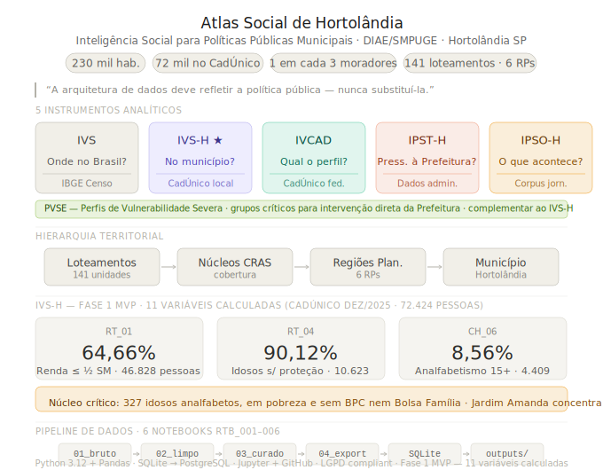
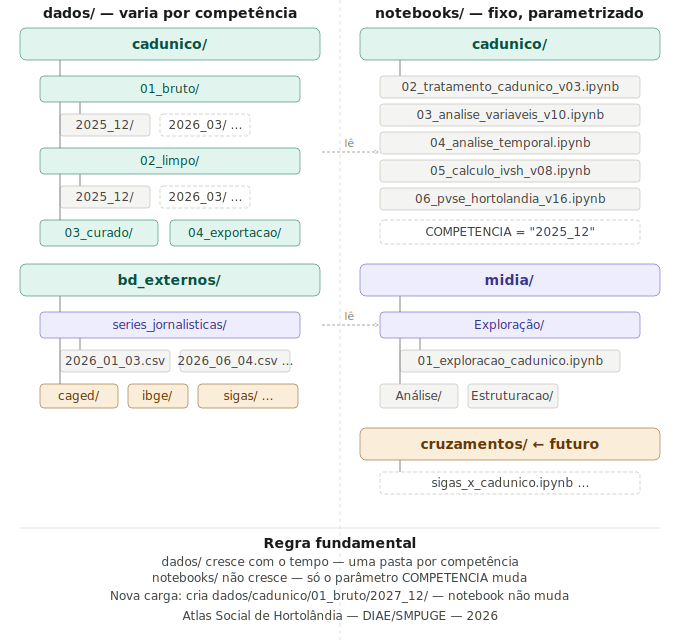

# Atlas Social de Hortolândia
Arquitetura de Inteligência Social para Políticas Públicas Municipais

Repositório do projeto **Atlas Social de Hortolândia**, iniciativa de arquitetura de dados sociais aplicada à política socioassistencial do município de Hortolândia – SP.

O projeto estrutura uma **infraestrutura analítica** capaz de compreender e acompanhar a dinâmica da vulnerabilidade social no território municipal, utilizando dados públicos já existentes e respeitando integralmente a legislação de proteção de dados.

<p align="center">
  
</p>

---
<p align="center">
  
</p>
---

## Contexto

Hortolândia possui aproximadamente **240 mil habitantes** e cerca de **72 mil pessoas inscritas no Cadastro Único** — quase **1 em cada 3 moradores**.

Apesar da escala da política socioassistencial, os dados disponíveis ainda não permitem responder com precisão perguntas fundamentais para a gestão pública:

- Quem está sendo atendido?
- Onde estão as famílias que não estão sendo atendidas?
- Quanto tempo as famílias permanecem em situação de vulnerabilidade?
- Quantas pessoas conseguem alcançar emancipação social?

---

## Princípio central

> **A arquitetura de dados deve refletir a política pública — nunca substituí-la.**

A proposta de modelagem não altera fluxos institucionais, não cria novos cadastros e não redefine competências administrativas. Ela organiza os **dados já existentes** para uma leitura estratégica, territorial e longitudinal da política socioassistencial.

---

## Sistema de instrumentos analíticos

O projeto é estruturado em cinco instrumentos complementares:

| Instrumento | Pergunta central | Base |
|---|---|---|
| **IVS** (IPEA) | Onde está a vulnerabilidade no Brasil? | IBGE Censo |
| **IVS-H** | Onde está dentro do município? | CadÚnico local |
| **IVCAD** | Qual é o perfil de quem já está cadastrado? | CadÚnico federal |
| **IPST-H** | Onde a vulnerabilidade pressiona o Estado agora? | Dados administrativos |
| **IPSO-H** | O que está acontecendo agora? | Corpus jornalístico |

Complementar ao IVS-H:

| Camada | Descrição |
|---|---|
| **PVSE** | Perfis de Vulnerabilidade Severa — detecção de grupos críticos para intervenção direta |

> *"O IVS mostra onde está a vulnerabilidade. O IPST-H mostra onde ela se transforma em pressão sobre o Estado. O IPSO-H mostra o que está acontecendo agora."*

---

## IVS-H — Fase 1 MVP: resultados calculados

Base: CadÚnico dez/2025 — 72.424 pessoas

| Variável | Descrição | Resultado |
|---|---|---|
| RT_01 | Renda per capita ≤ ½ SM | **58,8%** das famílias |
| RT_04 | Renda ≤ ½ SM + idoso dependente | **8,12%** das famílias (~2.465) |
| CH_06 | Analfabetismo 15+ | **8,69%** — 4.516 pessoas |
| CH_05 | Mães chefes sem fund. completo | ⏳ em cálculo |
| CH_07 | Crianças sem adulto escolarizado | ⏳ em cálculo |

**Núcleo mais crítico identificado:** 298 idosos analfabetos, pobres e sem BPC nem Bolsa Família.

---

## Hierarquia territorial

```
Loteamento (141) → Núcleo CRAS → Região de Planejamento (6 RPs) → Município
```

---

## Estrutura do repositório

O repositório separa **dados** (varia por competência) de **notebooks** (fixos, parametrizados).

```
Atlas-Social-de-Hortolandia/
│
├── 00_governanca/              # Documentos estratégicos e de governança
│   ├── corpus_jornalistico/    # Regras de classificação, dicionário, README do corpus
│   └── *.md / *.pptx           # Palestras, arquitetura, IVS comparativo, legislação
│
├── dados/                      # Camada de dados — cresce por competência
│   ├── bd_externos/
│   │   ├── series_jornalisticas/   # CSVs diários Tribuna Liberal (IPSO-H)
│   │   ├── caged/
│   │   ├── ibge/
│   │   └── prefeitura_hortolandia/
│   ├── cadunico/
│   │   ├── 01_bruto/2025_12/   # ← competência atual
│   │   ├── 02_limpo/2025_12/
│   │   ├── 03_curado/
│   │   └── 04_exportacao/
│   └── sigas/
│
├── notebooks/                  # Camada analítica — fixa, parametrizada
│   ├── cadunico/               # Pipeline CadÚnico (COMPETENCIA = "2025_12")
│   │   ├── 02_tratamento_cadunico_v03.ipynb
│   │   ├── 03_analise_variaveis_cadunico.ipynb
│   │   ├── 04_analise_temporal_cadunico.ipynb
│   │   ├── 05_calculo_ivsh_cadunico_v02.ipynb
│   │   └── 06_perfis_vulnerabilidade.ipynb
│   └── midia/                  # Pipeline corpus jornalístico (IPSO-H)
│       ├── Exploração/
│       │   └── 01_exploracao_cadunico.ipynb
│       ├── Análise/
│       └── Estruturacao/
│
├── docs/diagramas/             # SVG e diagramas do sistema
├── outputs/                    # Tabelas e gráficos gerados
└── utils/                      # Funções auxiliares reutilizáveis
```

**Regra fundamental:** `dados/` cresce com o tempo — uma pasta por competência. `notebooks/` não cresce — apenas o parâmetro `COMPETENCIA = "XXXX_XX"` muda a cada nova carga.

---

## Pipeline de notebooks — CadÚnico

| Notebook | RTB | Entrada | Saída | Finalidade |
|---|---|---|---|---|
| `02_tratamento_cadunico_v03.ipynb` | RTB_002 | `01_bruto` | `02_limpo` | Limpeza e padronização |
| `03_analise_variaveis_cadunico.ipynb` | RTB_003 | `02_limpo` | `03_curado` | Análise exploratória de variáveis |
| `04_analise_temporal_cadunico.ipynb` | RTB_004 | `02_limpo` | — | Análise temporal |
| `05_calculo_ivsh_cadunico_v02.ipynb` | RTB_005 | `02_limpo` | `03_curado` | Cálculo das variáveis IVS-H |
| `06_perfis_vulnerabilidade.ipynb` | RTB_006 | `02_limpo` | `outputs/` | Perfis de Vulnerabilidade Severa (PVSE) |

---

## Corpus jornalístico (IPSO-H)

O IPSO-H é construído a partir da classificação sistemática de edições da **Tribuna Liberal** — jornal regional que cobre Hortolândia e municípios vizinhos.

Cada edição é classificada em CSVs estruturados com schema versionado (**v10.4 — 20 colunas**), armazenados em `dados/bd_externos/series_jornalisticas/`, permitindo rastrear ciclos de pressão social ao longo do tempo.

**Corpus atual (mai/2026):** 97 edições · 456 eventos classificados · 67 ciclos identificados

**Ciclos ativos:**

| Ciclo | Status |
|---|---|
| `CH_VIOLENCIA_CRIANCA_2026` | agravamento |
| `IU_AGUA_SABESP_2026` | agravamento |
| `CH_VIOLENCIA_GENERO_2025` | resposta |
| `CH_SAUDE_MENTAL_SITUACAO_RUA_2026` | resposta |
| `CH_SUPERLOTACAO_CARCERARIA_2026` | resposta |

---

## O que este repositório não contém

Por razões legais e éticas, este repositório **não inclui**:

- dados pessoais ou microdados do CadÚnico
- informações identificáveis de cidadãos
- dados operacionais de sistemas municipais

---

## Tecnologia

| Camada | Tecnologia |
|---|---|
| Processamento de dados | Python 3.12 + Pandas + NumPy |
| Ambiente analítico | Jupyter Notebook (Windows) |
| Banco de dados | SQLite 3 (MVP) → PostgreSQL (roadmap) |
| Versionamento | GitHub + GitHub Desktop |
| Visualização futura | QGIS + GeoJSON (141 loteamentos) |

---

## Contexto institucional

| | |
|---|---|
| Município | Hortolândia – SP (IBGE: 3519071) |
| Secretaria | Inclusão e Desenvolvimento Social (SMIDS) |
| Responsável técnico | Ailton Vendramini |
| Ano de início | 2026 |
| Fase atual | Fase 1 MVP — cálculo IVS-H em andamento |

---

## Licença

Projeto institucional público. Não contém dados pessoais. Segue os princípios da **LGPD** e boas práticas de governança de dados no setor público.

---

*Última atualização: "10/05/2026" — v06*
